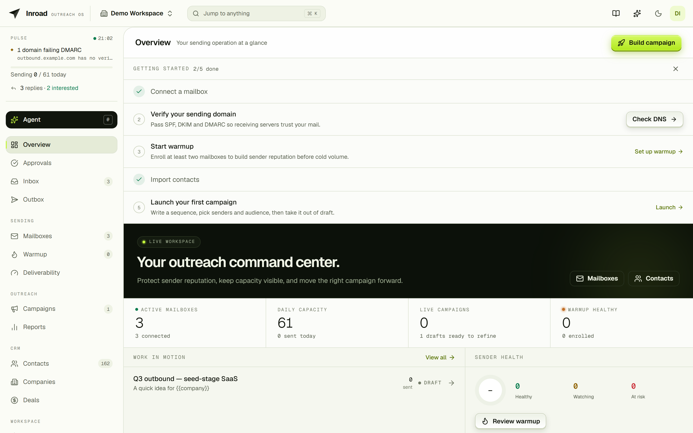
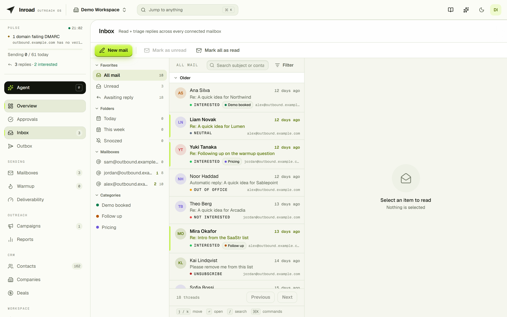

<div align="center">

<pre>
██╗ ███╗   ██╗ ██████╗   ██████╗   █████╗  ██████╗ 
██║ ████╗  ██║ ██╔══██╗ ██╔═══██╗ ██╔══██╗ ██╔══██╗
██║ ██╔██╗ ██║ ██████╔╝ ██║   ██║ ███████║ ██║  ██║
██║ ██║╚██╗██║ ██╔══██╗ ██║   ██║ ██╔══██║ ██║  ██║
██║ ██║ ╚████║ ██║  ██║ ╚██████╔╝ ██║  ██║ ██████╔╝
╚═╝ ╚═╝  ╚═══╝ ╚═╝  ╚═╝  ╚═════╝  ╚═╝  ╚═╝ ╚═════╝ 
</pre>

**The self-hostable cold email sequencing and mailbox warm-up platform.**

[](LICENSE)
[](go.mod)
[](web/package.json)
[](docker-compose.yml)
[](docs/self-hosting.md)

[Quick start](#quick-start) · [Features](#features) · [How it works](#how-it-works) · [Docs](#documentation) · [Security](#security)

⭐ **If Inroad saves you a per-seat subscription, star the repo**. It's the cheapest way to help.

</div>

---

Inroad sends cold email sequences from the mailboxes you already own (Gmail, Microsoft 365, or plain
SMTP) and paces them on a warm-up ramp so they keep landing in the inbox. Replies, bounces, and
opt-outs are polled back in, classified, and used to stop the sequence automatically. Everything runs
on your own hardware: one Postgres, one Redis, two Go binaries, and a React SPA. No SaaS account, no
per-seat pricing, no third party holding your mailbox credentials.

It's an open-source alternative to Instantly and Smartlead, built for people who would rather run the
infrastructure than rent it.

<div align="center">
  
</div>

---

## Quick start

**Run it** (self-hosting, only Docker required):

```bash
git clone https://github.com/Axomble/Inroad && cd Inroad
docker compose up -d
```

That's the whole install. Secrets are generated on first boot, migrations run automatically, and the
app is on <http://localhost>. Deployment options (env vars, Gmail/M365 OAuth setup, Terraform, Helm)
are in [docs/self-hosting.md](docs/self-hosting.md).

**Hack on it** (live-reloading dev stack, still only Docker required):

```bash
docker compose -f docker-compose.dev.yml up -d
```

Go hot-reloads via `air`, the SPA runs Vite HMR on <http://localhost:5173>, Mailpit catches every
transactional email on <http://localhost:8025>, and the docs site serves on <http://localhost:4321>.
Seed a demo workspace to log into:

```bash
docker compose -f docker-compose.dev.yml exec api go run ./cmd/seed
# → login demo@inroad.test / demodemo
```

Prefer running Go and Node natively? See [CONTRIBUTING.md](CONTRIBUTING.md). `make dev` (or
`.\scripts\dev.ps1` on Windows) does the same thing without containers for the binaries.

---

## Features

- **Sequencing**: multi-step campaigns with per-step delays, merge fields, A/B variants per step,
  timezone-aware send windows, and a natural send cadence that never emits on a uniform interval.
- **Sending infrastructure**: Gmail API, Microsoft Graph, and SMTP/IMAP behind one seam; sender
  pools with round-robin / LRU / weighted rotation; ramped daily caps and campaign-wide limits
  enforced on the send path.
- **Warm-up**: opted-in mailboxes exchange real threaded mail on a ramping volume; placement is
  measured (inbox vs spam), health is recomputed from it, and a mailbox that turns bad is paused
  instead of pushed. Warmup health gates cold sending.
- **Replies & deliverability**: reply polling across all three transports with deterministic,
  offline classification plus a user-definable taxonomy driving automation; DSN bounce handling;
  suppression and one-click unsubscribe; SPF/DKIM/DMARC checks per sending domain; a deliverability
  dashboard and cross-campaign reporting.
- **Unified inbox & CRM**: every reply from every mailbox in one threaded view, reply-from-inbox
  through the owning mailbox; companies, deals, pipelines, notes, tasks and an activity feed; typed
  custom fields validated at import and preflight; contacts at scale (trigram search, keyset paging).
- **AI, human-in-the-loop**: an in-app agent and AI-drafted replies behind an approval queue;
  bring your own key, and the entire feature is off (and makes no calls) until you add one.
- **Platform**: multi-workspace teams and roles; passkeys, TOTP, Google sign-in, refresh-token
  rotation; scoped API keys, an OAuth 2.0 provider, and an MCP server exposing the agent's typed
  tools; envelope-encrypted credentials with per-workspace crypto-shredding.



---

## How it works

Inroad splits into a **control plane** that owns all state and an **execution plane** that owns all
outbound network I/O. They meet at exactly one interface, `coreapi.Client`.

**The split is logical, not physical — read that literally.** Worker packages reach relational data
only through `coreapi`, enforced by convention, review and a lint rule. But the worker *process*
still opens its own `pgxpool`, and `coreapi` is an in-process implementation, not a network call. So
a compromised worker host is not yet contained by anything except the code it is running. Giving
`coreapi` an HTTP transport so the split becomes physical is planned, not built — the seam was
designed for it ("in-process now, HTTP later"). Nothing below claims otherwise.

### Zoomed out — the pieces and what moves between them

```
                         CONTROL PLANE                              EXECUTION PLANE
   ┌───────────────────────────────────────────────┐   ┌──────────────────────────────────┐
   │  web/ SPA ──REST──▶ cmd/inroad                │   │  cmd/worker                      │
   │                       │                       │   │   one binary, INROAD_WORKER_ROLE │
   │   auth · mailbox · campaign · contact ·       │   │                                  │
   │   enrollment · inbox · crm · deliverability   │   │   role=control ─┐                 │
   │                       │                       │   │   role=send   ─┤                 │
   │              ┌────────┴────────┐              │   │   role=all (default, self-host)  │
   │              │                 │              │   └────────┬─────────────────────────┘
   │        ┌─────▼─────┐    ┌──────▼──────┐       │            │
   │        │ Postgres  │    │    Redis    │       │            │  outbound, per mailbox
   │        └─────┬─────┘    │   (asynq)   │       │            ▼
   │              │          └──────┬──────┘       │        SMTP · Gmail API · MS Graph
   │              │                 │              │
   │              └── coreapi.Client┼──────────────┼────────────┘
   │                 (in-process)   │              │   ⚠ the worker also holds its OWN
   └────────────────────────────────┼──────────────┘     pgxpool — see the note above
                                    │
                       queues, and who consumes them
                ┌───────────────────┴────────────────────┐
                │  control  → the 6 periodic reconciles   │  role=control, role=all
                │  send     → sends, polls, webhooks      │  role=send,    role=all
                │  w:<id>   → one worker's warmup ticks   │  role=send,    role=all
                │  default  → transitional drain only     │  role=send,    role=all
                └────────────────────────────────────────┘
```

A queue is not decoration: asynq claims a task **before** consulting the handler table, so a process
that consumes a queue it cannot serve takes the task and fails it. `control` therefore consumes only
`control` — that single omission is what stops a control host eating sends.

### Zoomed in — one campaign step, end to end

```
  [control role]                    [redis]                    [send role]
        │                              │                            │
  sweep finds a due enrollment         │                            │
        │  enqueue ──────────────────▶ │  queue: send               │
        │                              │ ───────────────────────▶ claim (row lock is the
        │                              │                            │  idempotency guarantee;
        │                              │                            │  queue dedup is defence
        │                              │                            │  in depth)
        │                              │                            │
        │            coreapi.ResolveSenderTransport ◀───────────────┤
        │  control plane unwraps the workspace DEK, refreshes the   │
        │  OAuth token, returns a ready transport ─────────────────▶│  worker zeroizes it
        │                              │                            │  after use; it never
        │                              │                            │  holds a KEK
        │                              │                            │
        │                              │                      send ─┼──▶ provider
        │                              │                            │
        │            MarkStepDelivered (own committed statement) ◀───┤
        │            AdvanceStepCursor (separate, idempotent)   ◀───┤
        │                              │                            │
        │   a retry after delivery sees 'sent' and recover-forwards, never re-sends
```

Three properties worth knowing because they shape everything else:

- **Determinism.** `platform/cadence` computes a send instant as a seeded hash of stable ids, so a
  retry recomputes the identical time. Placement, scheduling and A/B assignment are computed, not
  coordinated — which is why there is no central assignment service to keep consistent.
- **Credentials never sit still.** The control plane is the only holder of the wrapping key; the
  worker receives an already-decrypted transport for one send and zeroizes it. It has no way to
  unwrap anything it was not handed.
- **Send windows are unrepresentable-if-overlapping** via a GiST exclusion constraint — an illegal
  state made impossible at the schema rather than validated in application code.

Outbound mail leaves through each mailbox's own provider, not the worker's IP. Secrets are
envelope-encrypted per workspace behind a `KeyProvider` seam. The full write-up is in
[docs/architecture.md](docs/architecture.md); the non-negotiables — the ones that must never be
broken — are in [docs/security.md](docs/security.md).

---

## Documentation

| Read this | To learn |
|---|---|
| [docs/architecture.md](docs/architecture.md) | The control/execution split, transports, encryption, reply classification |
| [docs/security.md](docs/security.md) | The security invariants. Read before touching credentials, dials, or tenant queries |
| [docs/self-hosting.md](docs/self-hosting.md) | Deploying, env vars, and connecting Gmail / M365 (OAuth setup, scopes, redirect URIs) |
| [api/openapi.yaml](api/openapi.yaml) | The REST contract. The SPA's typed client is generated from it |
| [CONTRIBUTING.md](CONTRIBUTING.md) | Dev loop, native setup, tests, and what a good PR looks like |

The same docs ship as a browsable site (`docs/`, Astro/Starlight). The dev stack serves it on
<http://localhost:4321>.

---

## Status

Pre-1.0 and under active development. Everything in [Features](#features) works today and is covered
by unit and integration tests. Notable roadmap items: lead-flow throttling, list verification before
send, soft-bounce retry and FBL ingestion, custom tracking domains, outbound webhooks, cloud KMS, and
billing for the open-core split. Open work is tracked as
[GitHub issues](https://github.com/Axomble/Inroad/issues).

---

## Contributing

Pull requests are welcome. Keep each one to a single logical change, open an issue first for anything
architectural, branch by type (`feature/…`, `fix/…`, `chore/…`), and keep `make test` /
`make test-integration` / `make lint` green. Details in [CONTRIBUTING.md](CONTRIBUTING.md); repo
conventions live in [CLAUDE.md](CLAUDE.md).

---

## Security

Inroad handles mailbox credentials, so security is a hard requirement rather than a feature:
credentials are envelope-encrypted and never appear in a response or a log, every tenant-scoped query
is pinned to a `workspace_id`, user-supplied hosts are dialed only through the SSRF guard, and TLS is
enforced by default on SMTP and IMAP. The invariants are written down in
[docs/security.md](docs/security.md).

**Found a vulnerability?** Please report it privately: open a
[GitHub security advisory](https://github.com/Axomble/Inroad/security/advisories/new) rather than a
public issue. Responsible disclosure is credited in the release notes.

---

## License

[Apache License 2.0](LICENSE). Copyright 2026 Ahmed Mustufa Malik.
