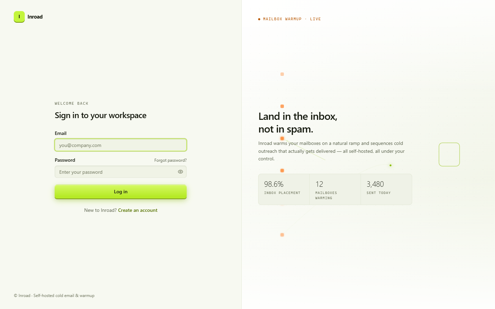
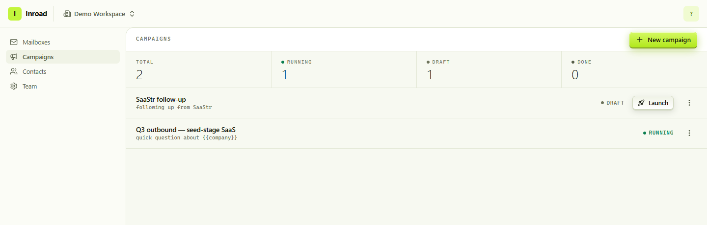
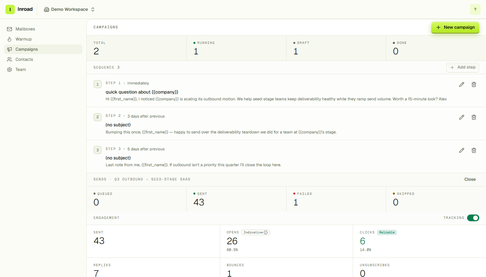
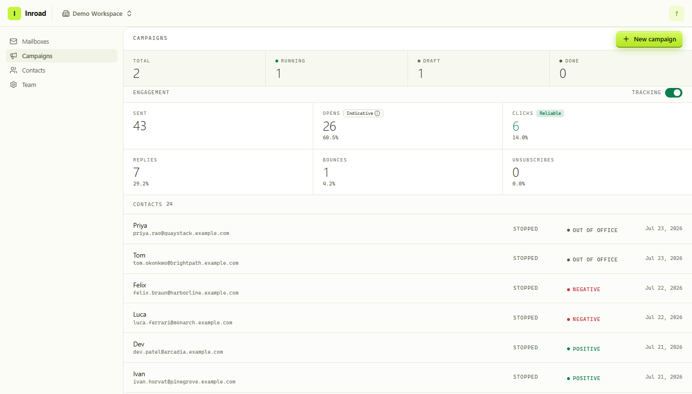
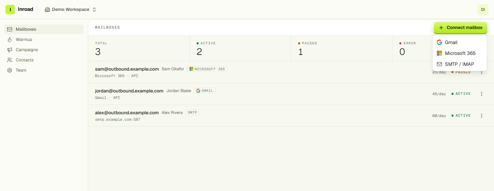
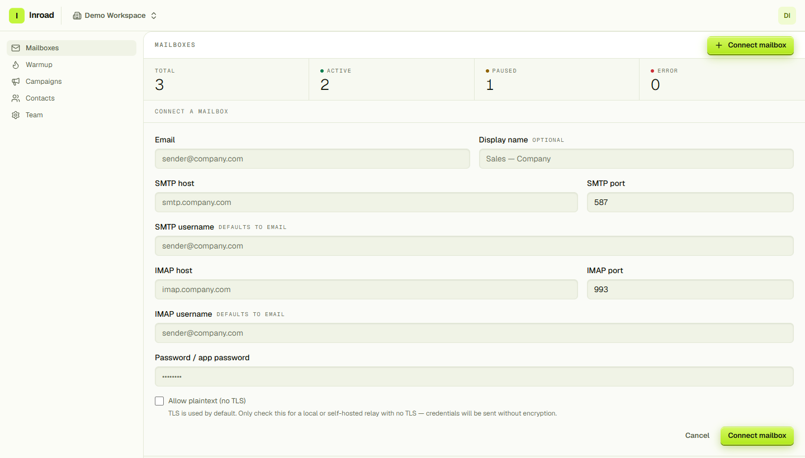
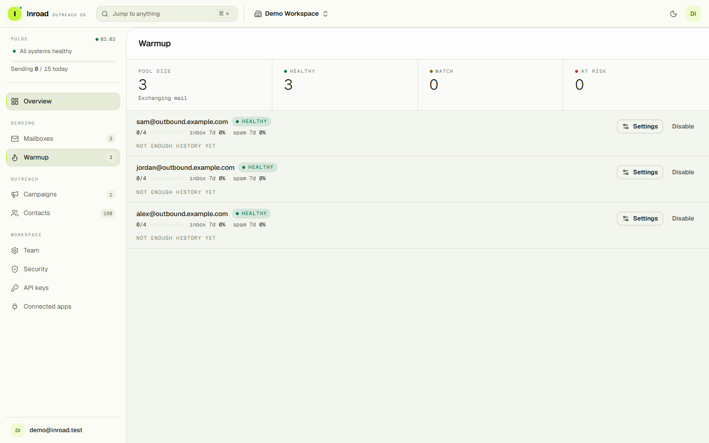
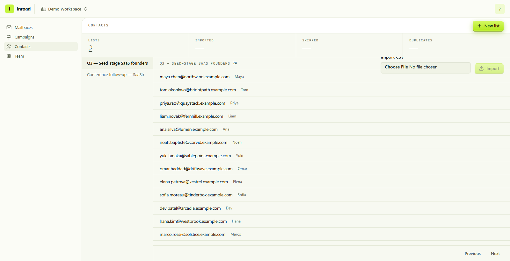

<div align="center">

<pre>
██╗ ███╗   ██╗ ██████╗   ██████╗   █████╗  ██████╗ 
██║ ████╗  ██║ ██╔══██╗ ██╔═══██╗ ██╔══██╗ ██╔══██╗
██║ ██╔██╗ ██║ ██████╔╝ ██║   ██║ ███████║ ██║  ██║
██║ ██║╚██╗██║ ██╔══██╗ ██║   ██║ ██╔══██║ ██║  ██║
██║ ██║ ╚████║ ██║  ██║ ╚██████╔╝ ██║  ██║ ██████╔╝
╚═╝ ╚═╝  ╚═══╝ ╚═╝  ╚═╝  ╚═════╝  ╚═╝  ╚═╝ ╚═════╝ 
</pre>

**The self-hostable cold email sequencing and mailbox warm-up platform.**

[](LICENSE)
[](go.mod)
[](web/package.json)
[](deploy/compose/docker-compose.yml)
[](docs/self-hosting.md)

[Features](#features) · [How it works](#how-it-works) · [Quick start](#quick-start) · [Self-hosting](#self-hosting) · [Docs](#documentation) · [Security](#security) · [Contributing](#contributing)

⭐ **If Inroad saves you a per-seat subscription, star the repo** — it's the cheapest way to help.

</div>

---

Inroad sends cold email sequences from the mailboxes you already own — Gmail, Microsoft 365, or plain
SMTP — and paces them on a warm-up ramp so they keep landing in the inbox. Replies, bounces, and
opt-outs are polled back in, classified, and used to stop the sequence automatically. Everything runs
on your own hardware: one Postgres, one Redis, two Go binaries, and a React SPA. No SaaS account, no
per-seat pricing, no third party holding your mailbox credentials.

It's an open-source alternative to Instantly and Smartlead, built for people who would rather run the
infrastructure than rent it.

<div align="center">
  
</div>

---

## Features

| | |
|---|---|
| **Multi-step sequences** | Ordered steps with per-step delays, drag-to-reorder, and `{{first_name}}` / `{{company}}` merge fields. Structural edits are draft-only; copy edits stay live on a running campaign. |
| **Three transports, one seam** | Gmail API, Microsoft Graph, and SMTP/IMAP behind a single `MultiSender`. The worker doesn't know or care which one it's using. |
| **Mailbox warm-up pool** | Mailboxes you enable exchange real threaded mail with each other on a ramping daily volume — recipient-side, Inroad rescues the message from spam, marks it read, and sometimes replies in-thread. Per-mailbox health (`healthy` / `watch` / `at risk`) is recomputed from measured inbox-vs-spam placement, and a mailbox that goes bad is paused instead of pushed. |
| **Natural send cadence** | Sends are spread across the day through a distribution curve and nudged off the clock grid, so a launch never emits on a uniform interval. Every jitter is a seeded hash of stable ids, so a retried task recomputes the identical instant instead of drifting. |
| **Timezone-aware send windows** | Per-weekday sending windows in the campaign's own IANA zone, with overlapping intervals made unrepresentable by a database exclusion constraint. Follow-ups are placed inside the window too, not just first touches. |
| **Sender pools + rotation** | A campaign sends from a pool of mailboxes, rotated round-robin, least-recently-used, or weighted by remaining capacity and warmup age. Rotation spreads *contacts*, not sends: a follow-up must come from the mailbox that started the thread, or the reply references a Message-ID that address never sent. |
| **Health-gated cold sending** | Warmup health now stops cold volume rather than merely nudging it. A `paused` mailbox is excluded outright; `watch` and `throttled` scale its daily cap. Gating applies to threads already in flight, not only to new assignments. |
| **Campaign-wide daily limit** | A ceiling across the whole pool per UTC day, which can only ever lower throughput — never raise a mailbox above its own ramped, health-scaled cap. A campaign waiting on its limit stays active and visible rather than being failed. |
| **Ramp + daily caps on campaigns** | Every mailbox ramps linearly from a small starting cap to its full daily cap over N days. The cap is enforced on the send path — over-cap enrollments defer and retry, and a permanently mis-set cap fails out instead of looping forever. |
| **Reply detection & classification** | IMAP / Gmail history / Graph delta polling matches replies to the original send and classifies them — positive, negative, neutral, auto-reply, out-of-office, unsubscribe — with zero AI dependency and no network calls. |
| **Out-of-office trap fix** | A vacation auto-responder gets tagged but does *not* halt the sequence. An explicit opt-out inside an auto-reply still suppresses, because compliance wins. |
| **Bounce handling** | DSN parsing on inbound mail; hard bounces mark the send and stop the enrollment before the next step fires. |
| **Suppression & one-click unsubscribe** | Workspace-wide suppression list, signed unsubscribe tokens, opt-outs enforced at send time. |
| **Open / click tracking** | Signed, per-send tracking tokens, toggleable per campaign, with opens honestly labelled *indicative* and clicks *reliable*. |
| **Domain authentication checks** | SPF, DKIM, and DMARC verified per sending domain, so a missing or broken record is a visible state on the mailboxes you send from instead of silent spam-foldering. |
| **Live console pulse** | One O(1) aggregate read-model drives the whole chrome: a sidebar pulse card that stays quiet when healthy and promotes the worst problem first (with its reason and a link to the fix), live nav counts, and a today's-sends meter. Polls; no websockets to run. |
| **Unified cross-mailbox inbox** | Every reply from every connected mailbox in one threaded view, searchable, with the campaign and enrollment that produced it attached to the thread. Reply from the inbox and the message goes out through the mailbox that owns the thread. |
| **User-definable reply taxonomy** | The six built-in reply classes are a starting point, not the ceiling. Define your own labels with your own match rules and your own automation (stop the sequence, suppress, do nothing) — the poller applies them on the way in. |
| **A/B variants on sequence steps** | Multiple subject/body variants per step, assigned deterministically per enrollment, with per-variant send and reply counts so a winner is measured rather than guessed. |
| **AI assistant, human-in-the-loop** | An in-app agent (`@` from anywhere) that can read and act on your workspace through typed tools, plus AI-drafted replies in the thread view. Every write goes through an approval queue with a diff-style preview — nothing mutates without a click. Bring your own provider key; the whole feature is off until you add one. |
| **Deterministic classification stays the default** | Reply classification needs no AI and makes no network call. The model seam is an addition for the ambiguous middle, never a dependency — pull the key and the pipeline still classifies. |
| **CRM records** | Companies, deals and pipelines alongside contacts, with notes, tasks and a unified activity feed modelled polymorphically so one implementation serves every record type. Records link to each other, and each shows who created it — agent, member, or auto-capture. |
| **Typed custom fields** | Per-workspace field definitions with real types, mapped during CSV import and validated at campaign preflight, so a merge field can't reference something that isn't there. |
| **Deliverability dashboard** | Placement, bounce and complaint trends over time, with the at-risk senders promoted out of the chart and into a list you can act on. |
| **Cross-campaign reporting** | Every campaign's performance ranked side by side from a single query — sends, opens, clicks, replies, bounces — with workspace totals weighted by volume rather than averaged across campaigns. Lifetime figures, so a rate means the same thing here as on the campaign itself. |
| **Contacts at scale** | Server-side search across email, name and company via a trigram index, and keyset pagination that seeks by cursor instead of `OFFSET` — a page 200k rows in costs the same as the first. CSV import with skip/duplicate reporting. |
| **Multi-workspace teams** | One account, many workspaces. Owner / admin / member roles, email invites, workspace switcher. |
| **Sign in how you like** | Email + password, Google sign-in, passkeys (WebAuthn), and TOTP two-factor — with refresh-token rotation and reuse detection underneath all of them. |
| **Programmable surface** | Scoped API keys, an OAuth 2.0 provider so third-party apps can act on a workspace with consent, and an MCP server that exposes the same typed tools the in-app agent uses. |
| **Envelope-encrypted secrets** | Per-workspace data-encryption keys wrapped by a key-encryption key. Deleting a workspace crypto-shreds its secrets. |

---

## A look inside

The chrome keeps score everywhere: the sidebar's **pulse card** answers "is everything okay?" from
any page — quiet two lines when it is, severity-sorted problems with reasons and fix links when it
isn't — beside live nav counts, a `⌘K` palette, and keyboard list navigation with a visible hint bar.

### Run campaigns

Draft until you launch it, then running until it's done — with the launch button only where launching
is actually legal.



### Build the sequence

Steps, delays, and merge fields — with structural edits locked once the campaign is running, so you
can't reorder the ground out from under contacts mid-flight.



### Watch what actually happened

Send counts, engagement rates, and every enrollment with the reply class that stopped it.



### Connect the mailboxes you already own

Gmail and Microsoft 365 connect over OAuth; anything else connects over SMTP/IMAP. Credentials are
verified with a live connection test before they're saved, then sealed. The same page checks SPF,
DKIM, and DMARC per sending domain — with honest caveats where DNS can't prove a negative.



TLS is on by default, and turning it off is an explicit, persisted decision — the same policy is
applied to the connection test *and* to every subsequent send, so a mailbox can never silently
downgrade to cleartext auth.



### Warm them up

Enable warmup on two or more mailboxes and they start exchanging real threaded mail on a ramping
daily volume. Health is measured, not assumed — inbox-vs-spam placement over the trailing week
decides whether a mailbox reads as healthy, watch, or at risk, and a mailbox that turns bad gets
paused rather than pushed harder. Orange is reserved for this one concept in the whole product.



### Find contacts at any size



Search runs server-side across email, name and company, and paging seeks by cursor rather than
`OFFSET` — so the last page of a 200,000-contact workspace costs what the first one does. The count
above the list is exact until it would stop being cheap, then honest about it: `10,000+`.

### And where the replies land

Everything that comes back arrives in one place. The **inbox** threads replies across every connected
mailbox, carrying the campaign and enrollment that produced them, and sends your reply back out
through the mailbox that owns the thread. Replies are labelled by your own taxonomy, and the
**companies, deals and contact records** they belong to sit one click away — with notes, tasks and a
shared activity feed. The **AI assistant** is `@` away from any page and can act on all of it, but
every write it proposes waits in the approvals queue behind a preview of exactly what would change.

---

## How it works

Inroad splits into a **control plane** that owns all state and an **execution plane** that owns all
outbound network I/O. They meet at exactly one interface, `coreapi.Client`.

```
                        CONTROL PLANE                          EXECUTION PLANE
        ┌──────────────────────────────────────────┐      ┌──────────────────────┐
        │                                          │      │                      │
        │   cmd/inroad  ──── REST ────  web/ SPA   │      │      cmd/worker      │
        │       │                                  │      │                      │
        │       │  domains: auth · mailbox ·       │      │  sender ─────────────┼──▶ SMTP
        │       │  campaign · sequencestep ·       │      │  sequence (advance)  │    Gmail API
        │       │  contact · list · enrollment ·   │      │  inbox   (poll)      │    MS Graph
        │       │  suppression · tracking          │      │  track · personalize │
        │       │                                  │      │                      │
        │  ┌────┴─────┐   ┌────────┐               │      └──────────┬───────────┘
        │  │ Postgres │   │ Redis  │◀── asynq ─────┼─────────────────┘
        │  └──────────┘   └────────┘   job queue   │      workers reach data ONLY
        │       ▲                                  │      through coreapi.Client
        │       └────── coreapi.Client ────────────┼──────────────┘
        └──────────────────────────────────────────┘
```

**The worker never touches Postgres.** It asks `coreapi` for a job, gets back a short-lived
credential (a decrypted SMTP password or a freshly refreshed OAuth access token), sends, and reports
the outcome. Token refresh, re-sealing, and persistence all happen control-plane side. That seam is
in-process today and becomes an HTTP call the day you want workers on separate hosts and separate
IPs — nothing else changes.

**Outbound mail leaves through each mailbox's own provider**, not through the worker's IP, so
scaling throughput means adding mailboxes and workers rather than warming up new IPs.

**Secrets use a two-level key hierarchy.** Each field ciphertext is sealed under a per-workspace
data-encryption key (DEK), AAD-bound to the workspace id; each DEK is wrapped by a key-encryption key
(KEK) behind a `KeyProvider` seam. Today that's a local AES master key; a cloud KMS drops into the
same seam. Because DEKs cascade-delete with the workspace, deleting a workspace permanently shreds
its secrets.

Full write-up in [docs/architecture.md](docs/architecture.md); the non-negotiables are in
[docs/security.md](docs/security.md).

---

## Quick start

You need **Docker**, **Go 1.25+**, and **Node 22+**.

```bash
git clone https://github.com/Axomble/Inroad && cd Inroad
cp .env.example .env
```

Generate the two required secrets and put them in `.env`:

```bash
openssl rand -base64 32     # → INROAD_JWT_SECRET
openssl rand -base64 32     # → INROAD_MASTER_KEY  (must decode to 32 bytes)
```

Install the SPA's dependencies once, then bring the whole stack up with one command:

```bash
cd web && npm install && cd ..
make dev            # services + migrations + API + worker + SPA
```

On **Windows**, where `make` usually isn't installed, use the PowerShell equivalent — it also
patches Go onto `PATH`, which its installer doesn't do:

```powershell
.\scripts\dev.ps1
```

Either way you get Postgres on `:5433`, Redis on `:6379`, the API on `:8080`, and the SPA on
<http://localhost:5173>.

Seed a demo workspace to log into:

```bash
make seed
# → login demo@inroad.test / demodemo
```

> **Note**
> Nothing in `cmd/*` reads `.env` itself — the Makefile and `dev.ps1` load it for you. If you run
> `go run ./cmd/inroad` directly, export it first (`set -a && . ./.env && set +a`), or the API will
> exit with `INROAD_JWT_SECRET must be set` even though the file is right there.

> **Note**
> Go has no hot reload. The SPA picks up changes immediately; the API and worker need a restart, so
> a Go change that seems to have done nothing usually means a stale process.

### Every make target

| Target | What it does |
|---|---|
| `make dev` | Everything: services, migrations, API, worker, SPA (Windows: `.\scripts\dev.ps1`) |
| `make db-up` / `db-down` | Start / stop the dev Postgres + Redis |
| `make seed` | Create the demo workspace and user |
| `make migrate-up` / `migrate-down` | Apply / roll back one migration |
| `make sqlc` | Regenerate the sqlc query layer |
| `make run-api` / `run-worker` | Run the API server / the worker |
| `make build` | Build `inroad`, `worker`, `migrate`, `seed` into `./bin` |
| `make test` | Unit tests (no external services) |
| `make test-integration` | Integration tests, against a separate `inroad_test` database so your dev data is never touched (needs `make db-up`) |
| `make run-web` | SPA dev server only |
| `make lint` | golangci-lint + oxlint + strict `tsc` |

---

## Self-hosting

Inroad runs with no cloud account of any kind — no AWS, no GCP, no Stripe, no managed queue. One
command brings up the whole platform with zero manual configuration:

```bash
git clone https://github.com/Axomble/Inroad && cd Inroad
docker compose up -d
```

The stack uses default environment fallback values so `docker compose up -d` boots out of the box. The Nginx SPA runs on <http://localhost> (Port 80), the API serves on <http://localhost:8080>, database migrations execute automatically before API/Worker boot, and the worker attaches to Redis.

For local live-reloading dev, copy `cp docker-compose.override.yml.example docker-compose.override.yml` and run `docker compose up` (Air hot reloading for Go backend, Vite HMR for React SPA).

For cloud infrastructure, production deployment manifests are included in the repository:
- **AWS Cloud (Terraform):** Complete VPC, RDS PostgreSQL, ElastiCache Redis, S3, ECS Fargate (API & Worker), ALB, IAM roles, and KMS key manifests in [`deploy/terraform/aws/main.tf`](deploy/terraform/aws/main.tf).
- **Kubernetes (Helm Chart):** Production Helm chart with Deployments, Service, ConfigMaps, Secrets, and Ingress templates in [`deploy/helm/inroad/`](deploy/helm/inroad/).

| Concern | Self-host default | Optional / swap-in |
|---|---|---|
| Database | PostgreSQL 16 (container) | Any Postgres — RDS, Cloud SQL, Neon |
| Cache / job queue | Redis 7 (container, asynq) | ElastiCache, any Redis |
| Root key (KEK) | Local AES-256 master key | Cloud KMS — the `KeyProvider` seam exists, the provider does not yet |
| Mail transport | Your own mailboxes | Gmail API · Microsoft Graph · any SMTP/IMAP host |
| Reply classification | Deterministic, offline, no network | An optional model seam for the ambiguous middle |
| AI features | Off — no key, no calls, no agent | Your own provider key, added per workspace; approval-gated writes |
| Payments / licensing | None — everything is unlocked | — |

Detailed deployment guides and configuration options are in [docs/self-hosting.md](docs/self-hosting.md). Connecting Gmail and Microsoft 365 (OAuth client
setup, exact scopes requested, redirect URIs) is covered step by step in
[docs/self-hosting.md](docs/self-hosting.md).

---

## Documentation

| Read this | To learn |
|---|---|
| [docs/architecture.md](docs/architecture.md) | The control/execution split, the transport abstraction, the encryption model, and how reply classification routes |
| [docs/security.md](docs/security.md) | The security invariants that must never be broken — read before touching credentials, outbound dials, or tenant queries |
| [docs/self-hosting.md](docs/self-hosting.md) | Deploying, generating keys, and connecting Gmail / M365 mailboxes |
| [api/openapi.yaml](api/openapi.yaml) | The REST contract. The SPA's typed client is generated from it — never hand-edited |
| [CLAUDE.md](CLAUDE.md) | Repo conventions: layering rules, naming, and the code-quality bar |
| [CONTRIBUTING.md](CONTRIBUTING.md) | Dev loop, tests, and what a good PR looks like |

---

## Project layout

```
cmd/                    thin binary entrypoints — inroad · worker · migrate · seed
internal/
  app/<domain>/         feature slices; each owns its own store + Routes()
  platform/             cross-cutting infra — config · log · db · httpx · queue · crypto · mail
  worker/               execution-plane engines — sender · sequence · inbox · track · warmup
  coreapi/              the control ⇄ execution seam
web/src/
  features/<domain>/    mirrors the backend domains
  routes/               composed from features/
api/openapi.yaml        REST contract; the SPA's client is generated from it
deploy/                 Dockerfiles + compose stacks
docs/                   architecture · security · self-hosting
```

Layering is enforced by convention and review: `app/*` may import `platform/*` but never the reverse,
`app/*` packages never import each other, and workers reach relational data only through `coreapi`.

---

## Status

Inroad is under active development and pre-1.0. What's built works and is covered by unit and
integration tests; what isn't built is listed here rather than implied by a feature grid.

**Working today:** multi-workspace auth with refresh-token rotation and reuse detection, TOTP, passkeys,
Google sign-in, scoped API keys and an OAuth 2.0 provider · Gmail / M365 / SMTP mailbox connect ·
multi-step sequences with reorder and per-step A/B variants · enrollment engine with ramp-aware daily
caps and atomic per-mailbox send spacing · natural send cadence and timezone-aware send windows ·
sender pools with round-robin / LRU / weighted rotation · health-gated cold sending and campaign-wide
daily limits · the warmup pool end-to-end (ramping volume, threaded replies, rescue-from-spam,
mark-read, measured placement health, per-IP worker routing) · reply and bounce polling across all
three transports · deterministic reply classification plus a user-definable reply taxonomy driving
automation · the unified cross-mailbox inbox with threaded reply · suppression and one-click
unsubscribe · open/click tracking · the deliverability dashboard and the
cross-campaign performance report · CRM records (companies, deals,
pipelines) with notes, tasks and an activity feed · typed custom fields, mapped on import and checked
at preflight · the approval-gated AI agent, its MCP server, and AI-drafted replies · server-side
contact search with keyset pagination · SPF/DKIM/DMARC domain authentication checks · the console
pulse read-model behind the live sidebar.

**On the roadmap:** lead-flow throttling, so a launch spreads across as many days as the pool's
capacity actually needs rather than queueing behind a daily cap · email verification / list cleaning
before send · soft-bounce retry with a threshold to suppress, and provider feedback-loop ingestion for
real complaint data · a custom branded tracking domain per workspace · outbound webhooks for
third-party integrations · billing and plan gating for the open-core split · cloud KMS as a second
`KeyProvider` · an audit log on auth, connect, and reply-driven suppression · a key-rotation CLI.

Open work is tracked as [GitHub issues](https://github.com/Axomble/Inroad/issues); anything labelled
`roadmap` is on the list above.

---

## Contributing

Pull requests are welcome. Keep each one to a single logical change, and open an issue first for
anything that changes the architecture or the product surface.

Before opening a PR:

```bash
make test              # unit
make test-integration  # needs make db-up
make lint              # golangci-lint + oxlint + strict tsc — keep it green
```

Branch by type (`feature/…`, `fix/…`, `chore/…`), never commit feature work straight to `main`, and
use conventional commits. Full details in [CONTRIBUTING.md](CONTRIBUTING.md); conventions and the
code-quality bar are in [CLAUDE.md](CLAUDE.md).

---

## Security

Inroad handles mailbox credentials, so security is a hard requirement rather than a feature. The
invariants are written down in [docs/security.md](docs/security.md) and every security-sensitive PR
is checked against them: credentials are envelope-encrypted and never appear in a response or a log,
every tenant-scoped query is pinned to a `workspace_id`, user-supplied hosts are dialed only through
the SSRF guard, and TLS is enforced by default on SMTP and IMAP.

**Found a vulnerability?** Please report it privately rather than opening a public issue — open a
[GitHub security advisory](https://github.com/Axomble/Inroad/security/advisories/new) on this
repository. Responsible disclosure is credited in the release notes.

---

## License

[Apache License 2.0](LICENSE). Copyright 2026 Ahmed Mustufa Malik.
