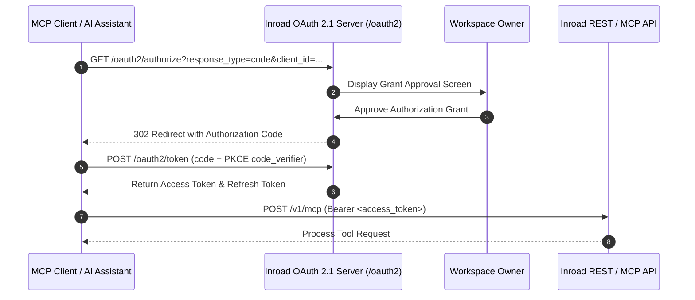

Security and multi-tenant isolation are core design invariants in Inroad. This guide covers multi-tenancy mechanics, authentication credentials (TOTP 2FA, WebAuthn Passkeys, API Keys), and the built-in OAuth 2.1 Authorization Server (`internal/app/auth`, `internal/app/twofa`, `internal/app/passkey`, `internal/app/apikey`, `internal/app/oauthprovider`).

---

## Security Invariant #1: Context-Derived Multi-Tenancy

Inroad enforces tenant isolation at both the application middleware layer and the PostgreSQL database schema layer (`internal/app/auth`).

```mermaid
graph TD
    Req[Incoming Client HTTP Request] --> JWT[JWT Verification Middleware]
    JWT -->|Verify Token & Claim| Ctx[Context: auth.UserFromContext]
    Ctx -->|Extract workspace_id| Service[App Domain Service]
    Service -->|Inject workspace_id into SQL| DB[(PostgreSQL)]

    DB -->|Composite FK Check: (id, workspace_id)| Query{Tenant Match?}
    Query -->|Match| Data[Return Tenant Records]
    Query -->|Mismatch| Fail[404 Not Found / Access Denied]
```

### Context Rules

1. **Context Derivation**: The active `workspace_id` is extracted strictly from verified JWT tokens or API key contexts via `auth.UserFromContext(ctx)`.
2. **No Parameter Trust**: Query parameters, URL path variables (e.g. `/api/v1/contacts?workspace_id=...`), or request body fields containing `workspace_id` are strictly IGNORED for authorization decisions.
3. **Database Schema Foreign Keys**: Tables utilize composite foreign keys (e.g., `campaign_senders(campaign_id, workspace_id)`) ensuring cross-tenant data referencing is rejected at the database level.

---

## Authentication Methods

Inroad supports multi-factor authentication and passwordless credentials.

### 1. Two-Factor Authentication (TOTP 2FA)

Inroad supports standard Time-based One-Time Passwords (`internal/app/twofa`) compatible with Google Authenticator, 1Password, and Authy:

- **Algorithm**: HMAC-SHA1 TOTP (RFC 6238) with 30-second time steps and 6-digit codes.
- **Setup Workflow**: Generates secret key and QR code URI (`otpauth://totp/...`).
- **Recovery Codes**: Encrypted backup recovery codes are provided upon setup.

### 2. Passkeys & WebAuthn (`internal/app/passkey`)

Passwordless authentication is powered by WebAuthn / FIDO2 standards:

- **Registration**: Browser creates public/private keypair using biometric hardware (Touch ID, Face ID, Windows Hello, YubiKey).
- **Challenge Verification**: Server generates cryptographically random single-use challenges stored with TTL in Redis.
- **RP ID & Origin Validation**: Strict validation prevents phishing by matching Relying Party ID (`rp_id`) and browser origin.

### 3. Workspace API Keys (`internal/app/apikey`)

Programmatic integration and CLI tools access Inroad via API keys:

- **Key Format**: Prefix-identified string formatted as `ink_live_<random_32_hex_chars>`.
- **Hashing**: Raw API keys are shown ONCE upon creation. Only SHA-256 hashes are persisted in the database.
- **Scopes & Expiry**: API keys can be scoped to specific permissions (e.g., `campaigns:read`, `contacts:write`) and configured with expiration dates.

---

## OAuth 2.1 Authorization Server & MCP Integration

Inroad features a full built-in **OAuth 2.1 Authorization Server** (`internal/app/oauthprovider` and `internal/app/mcpserver`).



### Key OAuth 2.1 Features

- **PKCE Mandatory**: Proof Key for Code Exchange (RFC 7636) with `S256` code challenge is strictly enforced for all authorization code grants.
- **No Implicit Grant**: Deprecated OAuth 2.0 flows (Implicit, Resource Owner Password Credentials) are disabled.
- **MCP Server Endpoints**: The OAuth provider grants scoped bearer tokens enabling Model Context Protocol (MCP) clients (Claude Desktop, Cursor, Windsurf) to securely query campaigns, contacts, and deliverability stats via `/v1/mcp`.

---

## REST API Reference

### Setup TOTP 2FA

```http
POST /api/v1/auth/2fa/setup
Authorization: Bearer <jwt_token>
```

#### Response

```json
{
  "secret": "JBSWY3DPEHPK3PXP",
  "qr_code_url": "otpauth://totp/Inroad:user@acme.io?secret=JBSWY3DPEHPK3PXP&issuer=Inroad",
  "recovery_codes": ["1a2b-3c4d", "5e6f-7g8h"]
}
```

### Create Workspace API Key

```http
POST /api/v1/api-keys
Authorization: Bearer <jwt_token>
Content-Type: application/json

{
  "name": "CI/CD Integration Key",
  "scopes": ["campaigns:read", "contacts:write"],
  "expires_in_days": 90
}
```

#### Response

```json
{
  "id": "550e8400-e29b-41d4-a716-446655440000",
  "name": "CI/CD Integration Key",
  "api_key": "ink_live_9f8a7b6c5d4e3f2a1b0c9d8e7f6a5b4c",
  "scopes": ["campaigns:read", "contacts:write"],
  "created_at": "2026-08-06T02:00:00Z"
}
```
