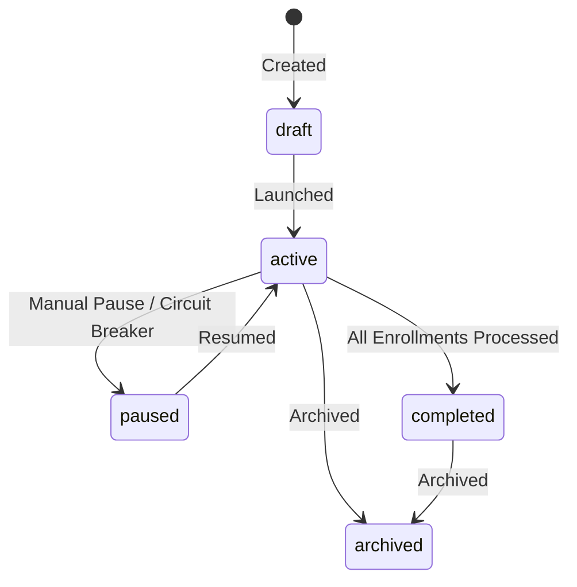
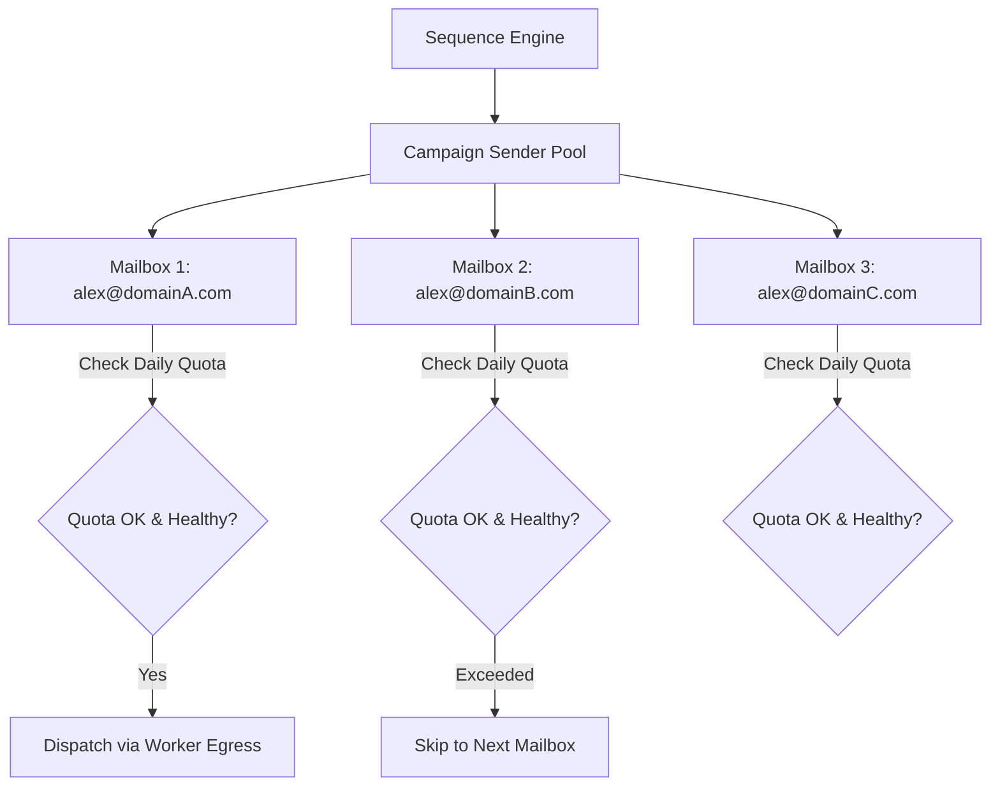
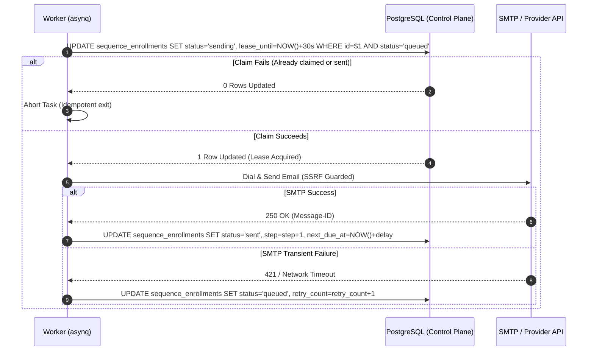

Inroad provides an enterprise-grade cold email orchestration engine designed to execute targeted, multi-step sequence cadences while protecting sending domain reputation. 

This guide covers campaign configuration, dynamic templating, sender pool rotation, and the underlying delivery lifecycle.

---

## Campaign Lifecycle & State Machine

Every campaign in Inroad progresses through defined operational states managed by the Control Plane (`cmd/inroad`) and executed by worker processes (`cmd/worker`).



| State | Status Description | Processing Behavior |
| :--- | :--- | :--- |
| `draft` | Campaign is being configured. Steps & senders can be added or updated. | No emails queued or dispatched. |
| `active` | Campaign sequence engine actively evaluates pending contact enrollments. | Sequence worker sweeps and enqueues due steps into `asynq`. |
| `paused` | Campaign is manually paused or auto-paused by the Deliverability Circuit Breaker. | Enrollments remain frozen in place; no outbound dispatches occur. |
| `completed` | All enrolled contacts have completed all sequence steps or replied. | Worker skips polling for this campaign. |
| `archived` | Campaign read-only reference state. | Metrics retained for analytics and reporting. |

---

## Multi-Step Sequence Cadences & Delay Triggers

A campaign sequence consists of an ordered chain of steps (`internal/app/sequencestep`). Each step defines message templates (Subject and Body) and timing rules relative to the previous step.

### Delay Trigger Configuration

Sequence steps can specify precise delays before execution:

- **`delay_days`**: Number of full calendar days to wait after the previous step completes.
- **`delay_hours`**: Fine-grained hourly offset added to `delay_days`.
- **Sending Schedule Windows**: Campaigns observe configured workspace schedules:
  - **Allowed Days**: e.g., Monday through Friday.
  - **Time Window**: e.g., `09:00` to `17:00` in the specified target timezone (e.g., `America/New_York`).
  - **Jitter & Cadence Spreading**: Outbound messages are randomly jittered across sending windows to mimic natural human typing behavior and avoid batch volume spikes.

---

## Dynamic Liquid Variables & Templating

Inroad utilizes a robust Liquid template engine (`internal/worker/personalize`) to render dynamic, contact-specific emails at execution time.

### Supported Template Variables

| Variable | Source Field | Example Output |
| :--- | :--- | :--- |
| `{{first_name}}` | `contacts.first_name` | `Sarah` |
| `{{last_name}}` | `contacts.last_name` | `Chen` |
| `{{email}}` | `contacts.email` | `sarah.chen@acme.io` |
| `{{company}}` | `contacts.company` | `Acme Corp` |
| `{{title}}` | `contacts.title` | `VP of Engineering` |
| `{{custom_fields.industry}}` | `contacts.custom_fields -> industry` | `Enterprise Software` |
| `{{custom_fields.tech_stack}}` | `contacts.custom_fields -> tech_stack` | `Go, React` |

### Fallback Filters & Liquid Logic

Liquid filters prevent embarrassing empty placeholders when metadata is missing:

```liquid
Hi {{first_name | default: "there"}},

I noticed your work at {{company | default: "your company"}}. Given your role as {{title | default: "a leader"}}, I thought...
```

Conditional Liquid logic is also supported:

```liquid

Congrats on your recent {{custom_fields.funding_round}} round!

I've been following {{company}}'s recent growth with great interest.

```

---

## Sender Pool Assignment & Rotation

To prevent single mailbox rate limits and protect domain reputation, campaigns utilize **Sender Pool Rotation** (`internal/platform/rotation`).



### Key Rotation Invariants

1. **Workspace Isolation**: Senders assigned to a campaign MUST belong to the same verified `workspace_id`. Cross-workspace sender pool contamination is structurally impossible.
2. **Quota & Health Filtering**: Before selecting a sender, Inroad verifies:
   - Mailbox `status` is `active` (not `paused`, `error`, or `throttled`).
   - Daily sending limit (`max_send_per_day`) has not been reached for the current UTC day.
   - Warmup health score meets minimum operational threshold.
3. **Rotation Algorithms**:
   - **Round-Robin**: Alternates sequentially through all available senders in the pool.
   - **Balanced Load**: Prefers senders with the lowest daily send ratio (`sent_today / max_send_per_day`).

---

## Claim-Before-Send Delivery Idempotency

To eliminate duplicate email delivery during network retries or worker restarts, Inroad enforces **Claim-Before-Send Delivery Idempotency** (`internal/worker/sender`).



### Step Finalize Lifecycle

1. **Claim Execution**: The execution worker executes an atomic SQL UPDATE setting `status = 'sending'` with a short lease expiration timestamp.
2. **Personalization Render**: Liquid templates are compiled with contact variables.
3. **Outbound Dispatch**: Egress SMTP connection or OAuth API call is performed.
4. **Finalization**:
   - **On Success**: Enrollment is updated (`status = 'completed'` or `status = 'active'`), next execution timestamp `next_due_at` is calculated based on step delay, and dispatch activity is recorded in `campaign_activities`.
   - **On Failure**: Retries are scheduled with exponential backoff up to the maximum retry limit (default: 3).

---

## REST API Reference

### Create a Campaign

```http
POST /api/v1/campaigns
Authorization: Bearer <jwt_token>
Content-Type: application/json

{
  "name": "Q3 Enterprise Outreach",
  "schedule_cron": "0 9 * * 1-5",
  "timezone": "America/New_York",
  "sender_ids": [
    "550e8400-e29b-41d4-a716-446655440000",
    "6ba7b810-9dad-11d1-80b4-00c04fd430c8"
  ]
}
```

### Add a Sequence Step

```http
POST /api/v1/campaigns/550e8400-e29b-41d4-a716-446655440000/steps
Authorization: Bearer <jwt_token>
Content-Type: application/json

{
  "step_number": 1,
  "delay_days": 0,
  "delay_hours": 0,
  "subject": "Quick question regarding {{company}}",
  "body_html": "<p>Hi {{first_name | default: 'there'}},</p><p>Loved your recent post on engineering scalability.</p>"
}
```
