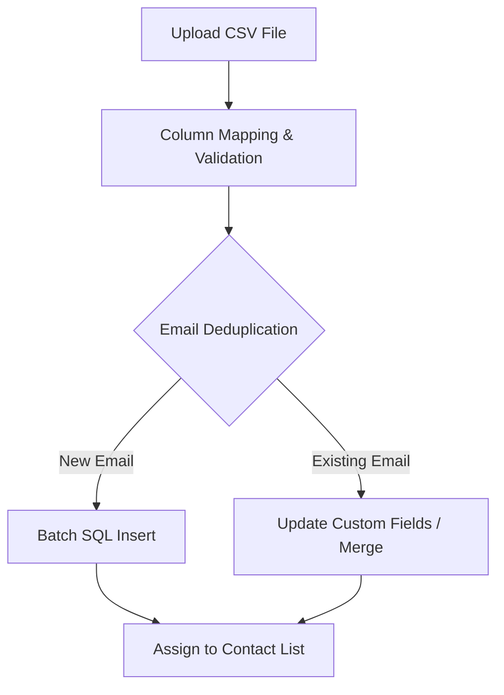
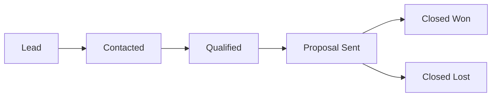

Inroad features a built-in Contact Relationship Management (CRM) platform engineered for low latency at enterprise volume (`internal/app/contact`, `internal/app/crm`, and `internal/app/list`).

---

## High-Performance Keyset Pagination & GIN Trigram Search

Standard `OFFSET / LIMIT` pagination degenerates to $O(N)$ scan times when querying millions of contact records. Inroad implements **Keyset (Cursor-Based) Pagination** combined with **PostgreSQL GIN Trigram Indexes** (`pg_trgm`).

### 1. Keyset Pagination

Queries use composite keys `(created_at, id)` for deterministic $O(1)$ page fetches regardless of table depth:

```sql
SELECT id, email, first_name, last_name, company, created_at
FROM contacts
WHERE workspace_id = $1
  AND (created_at, id) < ($2, $3) -- Cursor timestamp and ID
ORDER BY created_at DESC, id DESC
LIMIT 50;
```

### 2. Fast Fuzzy Search with GIN Trigram Indexes

To support sub-millisecond full-text fuzzy searching across contact names, emails, and companies, Inroad leverages `pg_trgm` GIN indexes:

```sql
-- Database index definition
CREATE INDEX idx_contacts_trgm ON contacts 
USING gin ((first_name || ' ' || last_name || ' ' || email || ' ' || COALESCE(company, '')) gin_trgm_ops);
```

This index permits instantaneous partial string matching (`WHERE email ILIKE '%acme%'` or similarity matching) without full table scans.

---

## Bulk CSV Imports & Contact Lists

Contact ingestion supports single contact creation as well as high-throughput bulk CSV imports (`internal/app/contact`).



### Ingestion Workflow

1. **Mapping Phase**: User maps CSV headers (e.g. `Work Email`, `First Name`, `Organization`, `Industry`) to standard contact attributes or JSONB `custom_fields`.
2. **Validation & Normalization**: Emails are verified for syntax validity and lowercased. Domain extraction is performed automatically.
3. **Deduplication Strategy**: Upsert operations use tenant-isolated unique keys (`workspace_id`, `email`) using `ON CONFLICT (workspace_id, email) DO UPDATE`.
4. **List Assignment**: Contacts can be tagged and grouped into static or dynamic `lists` (`internal/app/list`) for campaign targeting.

---

## CRM Companies, Deal Pipelines & Stage Transitions

Inroad goes beyond email addresses by supporting full sales pipelines (`internal/app/crm`).



### Key CRM Features

- **Companies (`crm_companies`)**: Group contacts under parent corporate entities with domain enrichment, size, industry, and custom metadata.
- **Deals & Pipelines (`crm_deals`)**: Associate revenue value, expected target close date, and pipeline stage with prospective accounts.
- **Stage Transitions**: Audit log records every stage transition with timestamps, user attribution, and pipeline velocity metrics.

---

## Activity Feeds & Thread Tracking

Inroad records a unified activity stream across all marketing and sales touchpoints:

```json
{
  "activity_type": "email_replied",
  "contact_id": "550e8400-e29b-41d4-a716-446655440000",
  "campaign_id": "6ba7b810-9dad-11d1-80b4-00c04fd430c8",
  "mailbox_id": "7ca7b810-9dad-11d1-80b4-00c04fd430c9",
  "metadata": {
    "classification": "interested",
    "sentiment_score": 0.89,
    "thread_id": "<CAB3x+..._at_mail.gmail.com>"
  },
  "created_at": "2026-08-06T02:00:00Z"
}
```

### Activity Types Tracked

- `contact_created` / `contact_updated`
- `email_sent` / `email_opened` / `link_clicked`
- `email_replied` (with reply classification tag)
- `deal_stage_changed`
- `note_added`

---

## REST API Reference

### Keyset Paginated Contact Search

```http
GET /api/v1/contacts?limit=25&query=acme&cursor=2026-08-01T12:00:00Z,550e8400-e29b-41d4-a716-446655440000
Authorization: Bearer <jwt_token>
```

### Bulk Import Contacts

```http
POST /api/v1/contacts/import
Authorization: Bearer <jwt_token>
Content-Type: application/json

{
  "list_id": "8fa7b810-9dad-11d1-80b4-00c04fd430d0",
  "contacts": [
    {
      "email": "david@acme.io",
      "first_name": "David",
      "last_name": "Miller",
      "company": "Acme Corp",
      "custom_fields": { "revenue": "$10M" }
    }
  ]
}
```

### Update Deal Stage

```http
PATCH /api/v1/crm/deals/9ba7b810-9dad-11d1-80b4-00c04fd430e1/stage
Authorization: Bearer <jwt_token>
Content-Type: application/json

{
  "stage": "qualified",
  "note": "Prospect confirmed budget and authority on discovery call."
}
```
