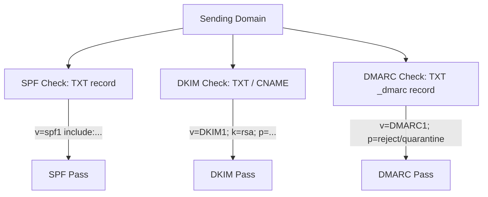

Sender reputation is the single most critical asset in cold outreach. Inroad provides automated DNS authentication auditing, real-time deliverability health scoring, auto-pausing circuit breakers, and machine event ingestion (`internal/app/deliverability`, `internal/app/sendingdomain`, and `internal/platform/dnsauth`).

---

## Domain DNS Authentication Auditing

Before any sending domain is approved for outreach, Inroad performs live DNS record validation (`internal/platform/dnsauth`).



### DNS Record Requirements

1. **SPF (Sender Policy Framework)**:
   - Checks that a `v=spf1` record is **published** at the domain apex. The check
     tests presence, not contents — it does not evaluate mechanisms or verify that
     any particular host is authorised.
   - The record must authorise whoever actually delivers your mail: your mailbox
     provider's outbound pool. Inroad worker egress IPs never belong in it, because
     Inroad authenticates to your provider rather than delivering to recipients
     itself.
   - Example: `v=spf1 include:_spf.google.com ~all`
2. **DKIM (DomainKeys Identified Mail)**:
   - Probes a set of common selectors and reports whichever answers first.
   - **Advisory only — DKIM never decides the verdict.** Selectors are not
     discoverable from DNS, so "not found" means only "none of the probed selectors
     matched". Failing a domain on that would tell an operator whose mail is
     correctly signed on an unusual selector that they are broken.
3. **DMARC (Domain-based Message Authentication, Reporting, and Conformance)**:
   - Checks for valid `_dmarc.yourdomain.com` record.
   - Validates policy configuration (`p=none`, `p=quarantine`, or `p=reject`).

A domain passes when **SPF and DMARC are both published**. A lookup that fails for
any reason other than NXDOMAIN is reported as `unknown`, never `failing` — "could
not check" rendered as "misconfigured" sends people editing DNS that was already
correct.

:::caution[The domain check is advisory and never blocks a campaign]
Nothing on the send path reads `sending_domains`. A `failing` domain does not stop
a campaign from being created, attached or run — an advisory that turns out to be
wrong must not be able to halt sending. What a failing check does withhold is
**warmup** traffic, which is Inroad's own mail: the mailbox enters the
`pending_auth` lane, which warns at campaign preflight rather than blocking it and
contributes no capacity reduction. See [invariant 39](/security/).
:::

---

## Deliverability Circuit Breaker

The **Deliverability Circuit Breaker** (`internal/app/deliverability` & `internal/worker/deliverability`) continuously evaluates bounce and complaint metrics in real-time. If reputation parameters degrade, it trips automatically to isolate the problem and protect remaining infrastructure.

```mermaid
graph TD
    E[Outbound Email Dispatches] --> EventIngest[Event Tracker / Webhook]
    EventIngest --> Window[Rolling Window Counter (24h)]
    
    Window --> Calc{Calculate Ratios}
    Calc -->|Hard Bounce Ratio > 5%| Trip[Trip Circuit Breaker]
    Calc -->|Spam Complaint Ratio > 0.1%| Trip
    
    Trip --> Pause[Auto-Pause Campaign & Mailbox]
    Trip --> Notify[Dispatch Operator Alert Notification]
```

### Circuit Breaker Metrics & Thresholds

| Metric | Warning Threshold | Critical Trip Threshold | Default System Action |
| :--- | :--- | :--- | :--- |
| **Hard Bounce Ratio** | > 3.0% in 24h | **> 5.0% in 24h** | Auto-pauses campaign and marks invalid contacts. |
| **Spam Complaint Ratio** | > 0.05% in 24h | **> 0.10% in 24h** | Immediately suspends sending domain & triggers review. |
| **Consecutive SMTP Rejections** | 5 consecutive | **10 consecutive** | Pauses specific mailbox connection. |

### Circuit Breaker States

- **`Closed` (Normal Operation)**: All health checks pass. Email sending flows normally.
- **`Open` (Tripped / Auto-Paused)**: Circuit breaker has tripped. Campaign sending is halted immediately to prevent domain blacklisting.
- **`Half-Open` (Recovery Testing)**: After manual review or verification, limited test traffic is permitted to monitor whether error rates normalize.

---

## Machine Event-Ingest Webhook (`POST /api/v1/deliverability/events`)

Inroad provides a unified, high-throughput machine event ingest endpoint (`POST /api/v1/deliverability/events`) to accept bounce, complaint, and delivery webhooks from external MTAs (SendGrid, Mailgun, Amazon SES, Postmark) as well as internal worker dispatches.

### Payload Schema

```json
{
  "event_type": "bounce",
  "workspace_id": "550e8400-e29b-41d4-a716-446655440000",
  "campaign_id": "6ba7b810-9dad-11d1-80b4-00c04fd430c8",
  "mailbox_id": "7ca7b810-9dad-11d1-80b4-00c04fd430c9",
  "recipient_email": "invalid.user@targetdomain.com",
  "bounce_type": "hard_bounce",
  "diagnostic_code": "550 5.1.1 User unknown",
  "timestamp": "2026-08-06T02:00:00Z"
}
```

### Processing Pipeline

1. **HMAC Signature Verification**: Webhooks verify payload authenticity via HTTP header signature (`X-Inroad-Signature`).
2. **Contact Suppression**: Hard bounces (`5xx` errors) automatically insert recipient emails into the workspace `suppressions` database table (`ON CONFLICT DO NOTHING`).
3. **Sequence Cancellation**: Any active sequence enrollments for the bounced contact are cancelled immediately.
4. **Circuit Breaker Score Update**: Increments failure metrics in Redis window counters and evaluates trip thresholds.

---

## REST API Reference

### Trigger DNS Authentication Check

```http
POST /api/v1/sending-domains/550e8400-e29b-41d4-a716-446655440000/check-dns
Authorization: Bearer <jwt_token>
```

### Machine Deliverability Event Webhook

```http
POST /api/v1/deliverability/events
X-Inroad-Signature: t=1754438400,v1=9f8a7b6c5d4e3f2a1b0c9d8e7f6a5b4c3d2e1f0a
Content-Type: application/json

{
  "event_type": "complaint",
  "workspace_id": "550e8400-e29b-41d4-a716-446655440000",
  "recipient_email": "complainer@domain.com",
  "timestamp": "2026-08-06T02:00:00Z"
}
```
