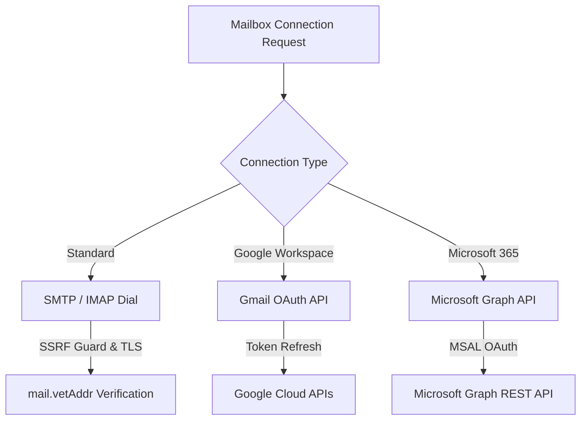
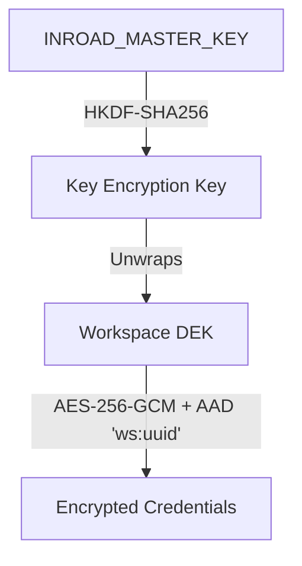

Mailboxes represent the foundational sending and receiving identity in Inroad. Because mailboxes store highly sensitive credentials (SMTP passwords and OAuth refresh tokens), Inroad implements stringent outbound connection controls, hardware-grade envelope encryption, and per-worker network egress routing.

---

## Supported Mailbox Connection Protocols

Inroad supports three primary mailbox connection mechanisms (`internal/app/mailbox` and `internal/platform/mail`).



### 1. Custom SMTP / IMAP Connections

Standard email servers (cPanel, SendGrid, Amazon SES, Custom Postfix) connect using native SMTP for sending and IMAP for inbox reply polling.

#### Outbound SSRF Protection (`mail.vetAddr`)
To prevent Server-Side Request Forgery (SSRF) attacks where malicious users register private IP addresses or internal microservices, all outgoing connections pass through `mail.vetAddr` before dialing:

- **Blocked Ranges**: Loopback (`127.0.0.0/8`, `::1`), Link-Local (`169.254.169.254`), Multicast, and Private RFC1918 networks (`10.0.0.0/8`, `172.16.0.0/12`, `192.168.0.0/16`).
- **DNS Rebinding Prevention**: `mail.vetAddr` resolves the hostname to an IP address, validates the IP against blocked ranges, and dials the validated IP directly while preserving the original host string for TLS ServerName (SNI) verification.
- **Mandatory TLS**: Plaintext unencrypted connections are strictly rejected. Connection must upgrade to STARTTLS or implicit TLS on port 465/587.
- **Override Flag**: For local development or air-gapped staging, set `INROAD_MAIL_ALLOW_PRIVATE_HOSTS=true`.

### 2. Gmail OAuth 2.0 API (`google`)

Gmail and Google Workspace accounts connect via Google OAuth 2.0 (`internal/app/oauthprovider`).

- **Scopes Required**: `https://www.googleapis.com/auth/gmail.send`, `https://www.googleapis.com/auth/gmail.readonly`, `https://www.googleapis.com/auth/gmail.modify`.
- **API Egress**: Outbound dispatches bypass port 25/587 and communicate directly over HTTPS to `gmail.googleapis.com`.
- **Automatic Token Refresh**: The core API seam automatically refreshes expired access tokens using sealed refresh tokens stored in the database.

### 3. Microsoft 365 Graph API (`microsoft`)

Microsoft Outlook and Office 365 business mailboxes connect using Azure AD OAuth 2.0 and Microsoft Graph API.

- **Scopes Required**: `Mail.Send`, `Mail.ReadWrite`, `offline_access`.
- **API Egress**: Communicates over HTTPS with `graph.microsoft.com/v1.0`.
- **Token Management**: Refresh tokens are handled via MSAL protocol workflows with automatic silent token renewal.

---

## Envelope Cryptography & GDPR Crypto-Shredding

Inroad employs a strict two-level Envelope Encryption scheme (`crypto.Sealer` & `crypto.KeyProvider`) to safeguard all stored mailbox credentials (passwords, OAuth access tokens, and refresh tokens).



### Encryption Architecture (DEK / KEK)

1. **Master Key (KEK)**: The platform master key `INROAD_MASTER_KEY` is supplied via environment variables. `LocalKeyProvider` derives a master Key Encryption Key using HKDF-SHA256.
2. **Data Encryption Key (DEK)**: Every workspace is provisioned with a unique, randomly generated 32-byte Data Encryption Key stored in `workspace_deks`.
3. **AES-256-GCM Envelope**: 
   - Mailbox credentials are encrypted using the workspace's specific DEK under AES-256-GCM.
   - Additional Authenticated Data (AAD) formatted as `ws:<workspace_id>` is bound into every AES-GCM cipher payload.
   - Cross-workspace ciphertext relocation or unauthorized DEK decryption immediately fails authentication tag verification.

### Instant GDPR Crypto-Shredding

When a workspace is deleted or zeroed out:

```sql
DELETE FROM workspace_deks WHERE workspace_id = $1;
```

Cascading deletion of `workspace_deks` immediately destroys the unique Data Encryption Key. Even if database backups persist historical ciphertexts, all stored credentials become mathematically impossible to decrypt, providing instant GDPR compliance and cryptographically verifiable data destruction.

---

## Connection Testing & Egress IP Worker Routing

### Pre-Flight Connection Testing

Before activating a mailbox, Inroad executes a multi-step pre-flight check (`net_tester.go`):

1. **DNS Resolution & SSRF Validation**: Verifies MX, A, and AAAA records via `mail.vetAddr`.
2. **Socket Handshake & TLS Certificate Verification**: Confirms valid TLS handshake and hostname matching.
3. **Authentication Handshake**: Performs test SMTP `AUTH LOGIN` / `AUTH PLAIN` or OAuth token exchange without sending an email.
4. **IMAP / Folder Access**: Verifies IMAP login and checks for required folders (`INBOX`, `Spam`/`Junk`, `Sent`).

### Per-IP Worker Egress Routing (`INROAD_WORKER_EGRESS_IP`)

For high-volume senders, dedicated IP reputation is crucial. Inroad worker processes support per-worker network interface binding (`internal/platform/mail` and `internal/platform/config`):

```bash
# Environment variable for worker node 1
INROAD_WORKER_EGRESS_IP=192.0.2.10

# Environment variable for worker node 2
INROAD_WORKER_EGRESS_IP=192.0.2.11
```

When `INROAD_WORKER_EGRESS_IP` is configured:

- Outbound TCP sockets dial from the specified local network IP interface.
- Mailbox-to-worker affinity rules (`worker_routing` database table) allow routing specific mailboxes to dedicated worker nodes with matching egress IP addresses.

---

## REST API Reference

### Connect a SMTP/IMAP Mailbox

```http
POST /api/v1/mailboxes
Authorization: Bearer <jwt_token>
Content-Type: application/json

{
  "email": "alex@acme.io",
  "display_name": "Alex Rivera",
  "connection_type": "smtp_imap",
  "smtp_host": "smtp.acme.io",
  "smtp_port": 587,
  "smtp_username": "alex@acme.io",
  "smtp_password": "super-secret-password",
  "imap_host": "imap.acme.io",
  "imap_port": 993,
  "imap_username": "alex@acme.io",
  "imap_password": "super-secret-password",
  "max_send_per_day": 50
}
```

### Trigger Pre-Flight Connection Test

```http
POST /api/v1/mailboxes/550e8400-e29b-41d4-a716-446655440000/test
Authorization: Bearer <jwt_token>
```
