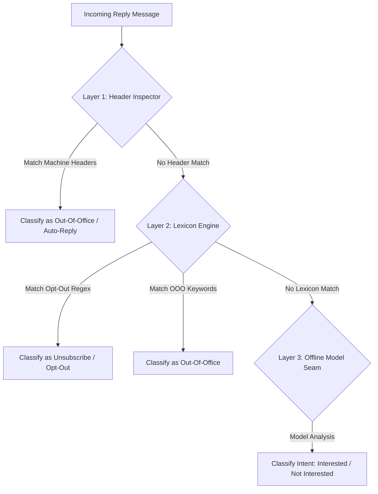
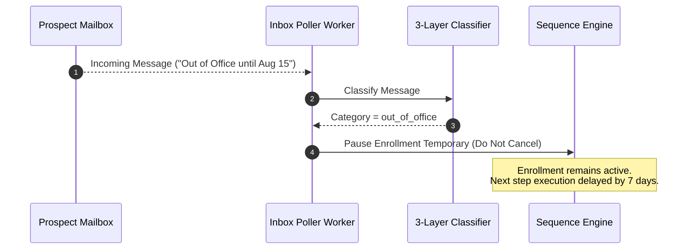

When prospects respond to cold outreach, accurately classifying their intent (e.g. Interested, Meeting Requested, Unsubscribe/Opt-Out, Out of Office, Not Interested) is essential for workflow automation and legal compliance.

Inroad features a **Pure Offline 3-Layer Reply Classifier** (`internal/platform/replyclassify` and `internal/worker/inbox`) that operates completely local to the system without external API dependencies.

---

## The 3-Layer Classification Pipeline

Every incoming reply fetched by the inbox poller worker passes sequentially through three deterministic classification layers to resolve one of seven `reply_class` values: `positive`, `negative`, `neutral`, `auto_reply`, `out_of_office`, `unsubscribe`, or `unknown`. Classification only decides *automation* behavior — compliance suppression, OOO deferral — never whether the message survives. Every matched reply, whatever class it resolves to, is durably stored and surfaces workspace-wide in the [Unified Inbox](/guides/unified-inbox/), not just the ones flagged as positive.



### Layer 1: Machine Header Inspector

The first layer evaluates RFC 3834 and standard email headers for automated responses:

- `Auto-Submitted`: `auto-replied`, `auto-generated`
- `X-Autoreply`: `yes`
- `Precedence`: `bulk`, `junk`, `auto_reply`
- `Subject` Prefix: Starts with `Automatic reply:`, `Out of Office:`, `Abwesenheitsnotiz:`, `Autoreponse:`

*Result*: If header match succeeds, message is categorized as `out_of_office` or `auto_reply` with zero false positive risk.

### Layer 2: Lexicon Compliance-First Engine

The second layer scans the normalized text body using pre-compiled regex patterns prioritizing opt-out compliance:

```go
// Pattern examples from replyclassify lexicon
UnsubscribePatterns = []*regexp.Regexp{
    regexp.MustCompile(`(?i)\b(unsubscribe|opt\s*out|remove\s+me|stop\s+emailing|take\nme\soff)\b`),
    regexp.MustCompile(`(?i)\bdo\s+not\s+contact\b`),
}
```

*Compliance Guarantee*: If an opt-out intent is detected in Layer 2, classification immediately halts and returns `unsubscribe`. Compliance signals bypass downstream ML heuristics to guarantee 100% opt-out enforcement.

### Layer 3: Offline Model Seam (`replyclassify`)

For nuanced human replies, Layer 3 utilizes a local lightweight classification model seam to evaluate sentiment and intent:

- **`interested`**: Prospect expresses desire for a call, demo, or pricing information.
- **`meeting_requested`**: Prospect suggests specific dates or requests calendar links.
- **`not_interested`**: Prospect declines without explicit opt-out request.
- **`question`**: Prospect requests additional details or technical clarification.

---

## Out-of-Office (OOO) Auto-Responder Handling

Standard cold email platforms often treat OOO auto-replies as human responses, mistakenly stopping sequence cadences or marking leads as responded.



### Inroad OOO Fix Algorithm

1. **Detection**: Message is classified as `out_of_office`.
2. **State Preservation**: The contact's sequence enrollment status remains **`active`** (it is NOT marked as `replied` or `completed`).
3. **Execution Deferral**: The sequence worker automatically defers the next execution date (`next_due_at`) by a configurable grace period (default: 7 days), allowing the prospect to return to their inbox before receiving the next follow-up step.

---

## Reply-Driven Workspace Suppression (`ON CONFLICT DO NOTHING`)

When a reply is classified as `unsubscribe` or `do_not_contact`, Inroad automatically executes workspace-wide contact suppression (`internal/app/suppression`).

```sql
INSERT INTO suppressions (id, workspace_id, email, reason, created_at)
VALUES ($1, $2, $3, 'reply_unsubscribe', NOW())
ON CONFLICT (workspace_id, email) DO NOTHING;
```

### Compliance Invariants

1. **Workspace Isolation**: Suppressions apply across the entire `workspace_id`. If a prospect unsubscribes from Campaign A, they are automatically suppressed across Campaign B and all future campaigns in that workspace.
2. **Atomic Cancellation**: All active sequence enrollments for the suppressed email within the workspace are immediately marked as `cancelled`.
3. **Idempotency**: The `ON CONFLICT (workspace_id, email) DO NOTHING` clause guarantees idempotent ingestion without database constraint crashes during concurrent events.

---

## REST API Reference

### Test Reply Classification Engine

```http
POST /api/v1/reply-classify/test
Authorization: Bearer <jwt_token>
Content-Type: application/json

{
  "subject": "Re: Quick question",
  "body": "Please remove me from your mailing list immediately.",
  "headers": {
    "Auto-Submitted": "no"
  }
}
```

#### Response

```json
{
  "category": "unsubscribe",
  "confidence": 1.0,
  "matched_layer": "layer_2_lexicon",
  "action_taken": "suppression_queued"
}
```
