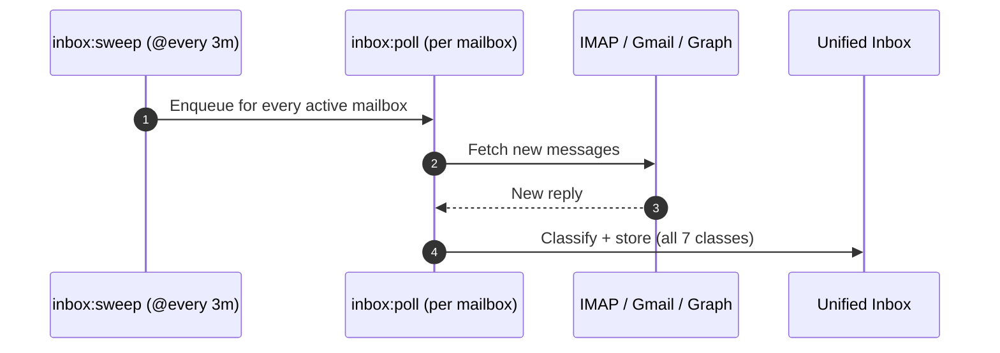

The Unified Inbox (`internal/app/inbox`, `internal/worker/inbox`, and the frontend's `features/inbox`) is a single, workspace-wide read model of every inbound reply that matched to a send. It is not a second mailbox and it does not send mail — it is where an operator triages what came back, across every connected mailbox, without switching provider webmail tabs.

---

## Every Matched Reply, Not Just Positive

Earlier in Inroad's history, only positive replies were persisted anywhere an operator could see them. That is no longer true: every reply that the 3-layer classifier matches to an active send is now stored and listed in the inbox, whatever class it resolves to.

| `reply_class` | What it means |
| :--- | :--- |
| `positive` | Prospect expressed interest. |
| `negative` | Prospect declined. |
| `neutral` | Ambiguous or informational reply. |
| `auto_reply` | Automated response, not a human reply. |
| `out_of_office` | Prospect is away; sequence is deferred, not stopped. |
| `unsubscribe` | Opt-out; triggers workspace-wide suppression. |
| `unknown` | Classifier reached no conclusion. |

See [Offline Reply Classification & Compliance](/guides/reply-classification/) for how a reply resolves to one of these classes and what automation (if any) each one triggers. Classification and storage are independent: the class only decides downstream automation, never whether the message is kept.

---

## Workspace-Wide Scope & the Scope Rail

The inbox lists threads across **all mailboxes in the workspace** by default. A scope rail on the left lets an operator narrow to one mailbox at a time, with a thread count per mailbox and for "All mailboxes" (drawn from a sample of the most recent threads, so it may undercount on a workspace with a very large inbox):

```mermaid
graph LR
    All[All mailboxes] --> M1[alex@domainA.com]
    All --> M2[alex@domainB.com]
    All --> M3[alex@domainC.com]
```

Selecting a mailbox is equivalent to passing `mailbox_id` on `GET /inbox/threads`; leaving it on "All mailboxes" omits the filter entirely, so replies are never siloed by sending identity the way they would be in raw provider webmail.

---

## Search & Filtering

Alongside mailbox scope, two more filters narrow the thread list:

- **Reply-class filter** — restrict to one of the seven classes above (e.g. only `positive`, or only `unsubscribe` for a compliance sweep).
- **Search** — a case-insensitive substring match against the thread's subject or its linked contact's email (`q` on `GET /inbox/threads`). `%` and `_` are matched literally, not as SQL wildcards.

The list is keyset-paginated, newest thread first: there's no opaque cursor, so paging past the last row on a page means resending its own `last_message_at`/`id` as `before_last_message_at`/`before_id` on the next request.

---

## Read + Triage Only in v1

The inbox is deliberately scoped to reading and triage for its first version:

- Opening an unread thread marks it read (`PUT /inbox/threads/{id}/read`) — that is the one write the UI performs today.
- There is **no reply, compose, or send from the inbox**. To respond to a prospect, an operator still switches to their own mail client (Gmail, Outlook, etc.) — the same mailbox the reply landed in — and replies from there.
- Inbound HTML message bodies are attacker-controlled (an external sender composed them), so they are sanitized with DOMPurify before being rendered in the thread reader and never trusted via a raw `dangerouslySetInnerHTML`.

Reply-from-inbox is intentionally out of scope for now; it would require the platform to hold send credentials for every connected mailbox behind this UI, which is a larger step than a read-only triage view.

---

## Relationship to CRM & Deals

The inbox and the [CRM](/guides/crm-contacts/) are complementary, not the same list:

- The inbox shows **every** matched reply, of every class, for triage — a full record of what came back.
- A `positive` reply *also* creates or links a CRM deal, through a separate, pre-existing mechanism (`crm_messages` / `crm_deals`) that predates the inbox. That linkage is unchanged by this feature.
- The CRM's contact activity timeline only records the positive-reply-driven deal activity, not the other six reply classes — it was never meant to be a full reply log, and still isn't.

In short: check the inbox to see everything that came back; check the CRM to see which replies turned into a sales conversation.

---

## Latency: Poll Interval, Not Real-Time

A new reply does not appear instantly. Inroad has no push/webhook ingestion for inbound mail — the existing `inbox:sweep` periodic task fans out an `inbox:poll` task for every active mailbox every 3 minutes, and each poll dials that mailbox's provider (IMAP, Gmail API, or Microsoft Graph) for new messages.



This feature ships no new real-time infrastructure: inbox latency matches the existing per-mailbox/provider poll cadence used for reply detection and warmup placement checks, typically a few minutes.

---

## REST API Reference

### List Threads (Workspace-Wide, Filterable)

```http
GET /api/v1/inbox/threads?mailbox_id=7ca7b810-9dad-11d1-80b4-00c04fd430c9&reply_class=positive&q=acme&limit=25
Authorization: Bearer <jwt_token>
```

#### Response

```json
{
  "items": [
    {
      "id": "550e8400-e29b-41d4-a716-446655440000",
      "mailbox_id": "7ca7b810-9dad-11d1-80b4-00c04fd430c9",
      "campaign_id": "6ba7b810-9dad-11d1-80b4-00c04fd430c8",
      "contact_id": "8fa7b810-9dad-11d1-80b4-00c04fd430d0",
      "contact_email": "sarah.chen@acme.io",
      "contact_first_name": "Sarah",
      "contact_last_name": "Chen",
      "subject": "Re: Quick question regarding Acme",
      "last_reply_class": "positive",
      "unread": true,
      "last_message_at": "2026-08-06T02:00:00Z"
    }
  ]
}
```

### Get a Thread's Full Message History

```http
GET /api/v1/inbox/threads/550e8400-e29b-41d4-a716-446655440000
Authorization: Bearer <jwt_token>
```

### Mark a Thread Read / Unread

```http
PUT /api/v1/inbox/threads/550e8400-e29b-41d4-a716-446655440000/read
Authorization: Bearer <jwt_token>
Content-Type: application/json

{
  "unread": false
}
```
