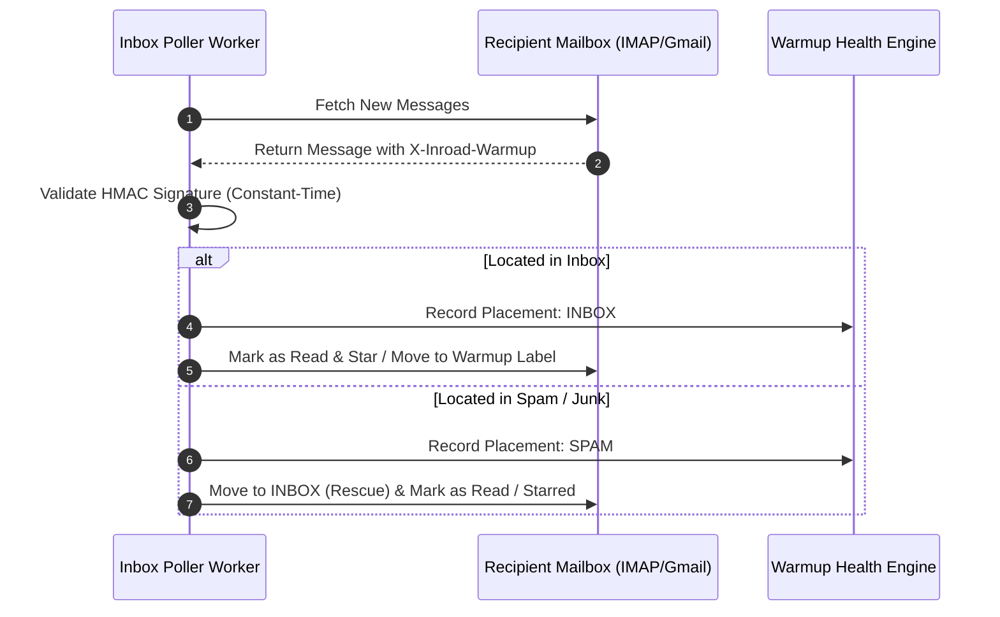
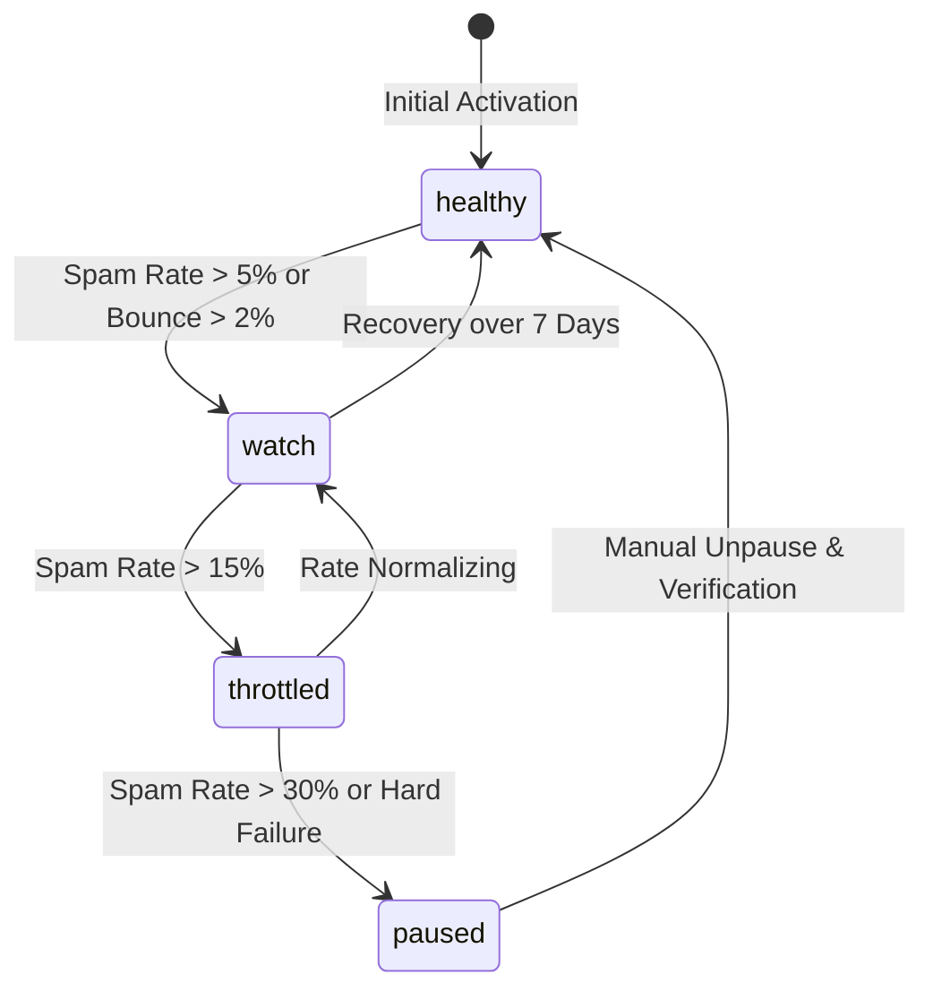

Mailbox warmup is an automated process that builds domain and IP sending reputation by exchanging human-like emails between mailboxes, monitoring placement, and automatically rescuing messages that land in Spam or Junk folders.

Inroad features a native, peer-to-peer, workspace-isolated warmup engine (`internal/app/warmup` and `internal/worker/warmup`).

---

## Peer-to-Peer Warmup Pool Architecture

The Inroad warmup pool operates on a decentralized peer-to-peer exchange model across active mailboxes enabled for warmup.

```mermaid
graph LR
    subgraph Pool [Peer-to-Peer Warmup Pool]
        M1[Mailbox A (Workspace 1)]
        M2[Mailbox B (Workspace 1)]
        M3[Mailbox C (Workspace 2)]
        M4[Mailbox D (Workspace 2)]
    end

    M1 <-->|Warmup Exchange| M3
    M2 <-->|Warmup Exchange| M4
```

### Warmup Exchange Workflow

1. **Ramp-Up Schedule**: Mailboxes start with a low daily warmup volume (e.g., 2 emails/day) and incrementally ramp up according to the configured daily ramp increment (e.g., +2 emails/day) up to `max_warmup_per_day`.
2. **Peer Selection**: The warmup scheduler matches target mailboxes across different domains and ESPs (Google Workspace, Microsoft 365, custom SMTP) to build a natural delivery footprint.
3. **Realistic Threading**: Warmup engines generate realistic email threads, complete with contextual replies, randomized sending intervals, and human-like typing delays.

---

## HMAC Header Verification (`X-Inroad-Warmup`)

To distinguish warmup messages from real cold outreach or external spam, Inroad stamps every outbound warmup email with a cryptographic header (`internal/platform/warmup`).

### Header Specifications

```http
X-Inroad-Warmup: v1;ts=1754438400;sig=a3f8b91c2e4d5f6a7b8c9d0e1f2a3b4c5d6e7f8a9b0c1d2e3f4a5b6c7d8e9f0a
```

### Security & Verification Rules

- **HMAC Signature**: Formatted using HMAC-SHA256 over the mailbox ID, recipient email, timestamp, and message ID using the platform secret.
- **Constant-Time Comparison**: Inbox poller worker (`internal/worker/inbox`) verifies incoming messages by parsing `X-Inroad-Warmup` and invoking `subtle.ConstantTimeCompare`.
- **Zero False Positives**: Validated warmup emails are intercepted and routed exclusively to the warmup engine before any campaign sequence or CRM processing can occur.

---

## Spam Placement Detection & Automatic Folder Rescue

When a warmup message arrives at a recipient mailbox, the inbox polling worker evaluates its folder location (`internal/platform/mail`).



### Folder Rescue Mechanism

1. **Detection**: If the HMAC-verified message is located in `Spam`, `Junk`, or tagged with Gmail's `SPAM` label:
   - The event is logged as a **Spam Placement**.
2. **Automatic Rescue**:
   - The worker issues an IMAP `MOVE` command or Gmail API `labels.remove("SPAM")` / `labels.add("INBOX")` call.
   - The message is marked as Read, Starred, and moved directly into the primary Inbox.
3. **Provider AI Training**: Moving spam messages to the inbox signals to inbox provider algorithms (Google, Microsoft, Proofpoint) that the sender's emails are desired, training their filters to inbox future outreach.

---

## Warmup Health Evaluation State Machine

Inroad continuously monitors mailbox deliverability health and transitions warmup statuses using an automated state machine (`internal/app/warmup`).



### Health States & Action Thresholds

| State | Health Criteria | System Action |
| :--- | :--- | :--- |
| `healthy` | Spam placement < 5%, Bounce rate < 2%. | Normal ramp-up schedule proceeds according to configuration. |
| `watch` | Spam placement between 5% and 15%. | Ramp-up paused; sending volume capped at current daily rate. Alert triggered. |
| `throttled` | Spam placement > 15% or sudden bounce surge. | Warmup volume automatically reduced by 50%. Associated campaigns auto-throttled. |
| `paused` | Spam placement > 30% or critical mailbox error. | Warmup sending suspended completely. Operator notification dispatched. |

---

## REST API Reference

### Enable Warmup for a Mailbox

```http
POST /api/v1/warmup/mailboxes/550e8400-e29b-41d4-a716-446655440000/enable
Authorization: Bearer <jwt_token>
Content-Type: application/json

{
  "max_warmup_per_day": 30,
  "ramp_up_per_day": 2,
  "reply_rate_percent": 30,
  "spam_rescue_enabled": true
}
```

### Get Warmup Health Analytics

```http
GET /api/v1/warmup/mailboxes/550e8400-e29b-41d4-a716-446655440000/stats
Authorization: Bearer <jwt_token>
```
